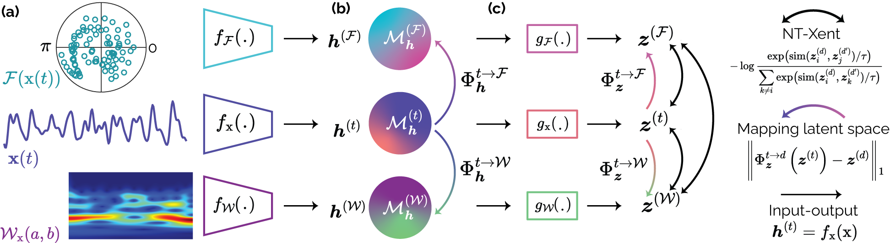

## Learning Without Augmenting: Unsupervised Time Series Representation Learning via Frame Projections

(NeurIPS 2025, Official Code)

**Berken Utku Demirel** and [**Christian Holz**](https://www.christianholz.net)<br/>
[Sensing, Interaction & Perception Lab](https://siplab.org), ETH Zürich, Switzerland

---

> This work introduces an unsupervised representation learning method for time series that replaces handcrafted augmentations with projections into orthonormal and overcomplete frames (Fourier & Gabor). We perform instance discrimination across these domains and use lightweight latent-space mappers to benefit from complementary geometries. Without increasing data diversity, our method achieves strong improvements across heart rate estimation, activity recognition, cardiovascular disease classification, step counting, and sleep staging.

---

Method Overview
<p align="center"> <a href="Figures/overall.pdf">  </a> </p> <p align="center"><strong>Figure 1.</strong> We project the original sample using frame projections (Fourier, Gabor) and perform instance discrimination across domains. Lightweight latent-space mappers transfer complementary geometry during inference.</p>


**Paper (arXiv):** https://arxiv.org/abs/2510.22655  
**NeurIPS 2025:** https://neurips.cc/virtual/2025/poster/118514

### TL;DR

We introduce an augmentation-free SSL method that learns from complementary views generated through Fourier and Gabor projections. By performing instance discrimination across these domains, the model captures diverse geometric structures. At inference, lightweight latent mappers replace additional encoders for efficient multi-view reasoning. The approach achieves up to 20% higher performance than prior methods across five tasks.

---

### Contents

* [Datasets](#datasets)
* [Environment](#environment)
* [Setup & Training](#setup--training)
* [Implementation](#implementation)

---

### Datasets

We evaluate across nine public datasets and five tasks:

* **Heart rate estimation:** IEEE SPC12, IEEE SPC22, DaLiA
* **Activity recognition:** HHAR, USC
* **Cardiovascular disease classification:** CPSC2018, Chapman
* **Step counting:** Clemson
* **Sleep staging:** Sleep-EDF

You can prepare the data using scripts from our previous works:
[https://github.com/eth-siplab/Unsupervised_Periodicity_Detection/tree/main/Heuristic_and_data_prep](https://github.com/eth-siplab/Unsupervised_Periodicity_Detection/tree/main/Heuristic_and_data_prep)
[https://github.com/eth-siplab/Finding_Order_in_Chaos](https://github.com/eth-siplab/Finding_Order_in_Chaos)

Or download the **preprocessed datasets** directly from Hugging Face:
[https://huggingface.co/datasets/eth-siplab/Learning-with-FrameProjections](https://huggingface.co/datasets/eth-siplab/Learning-with-FrameProjections)

---

### Environment

**Option A — Conda**

```bash
conda env create -f environment.yml
conda activate isoalign

# Install PyTorch (choose according to your setup)
# CUDA 12.x
pip install torch torchvision torchaudio --index-url https://download.pytorch.org/whl/cu121
# or CPU
# pip install torch torchvision torchaudio --index-url https://download.pytorch.org/whl/cpu
```

**Option B — Pip**

```bash
python -m venv .venv
source .venv/bin/activate  # Windows: .venv\Scripts\activate
pip install -r requirements_minimal.txt
```

---

### Quickstart

**Pre-training + testing (our method)**

```bash
python main.py \
  --framework isoalign \
  --backbone resnet \
  --dataset ieee_small \
  --n_epoch 256 \
  --batch_size 1024 \
  --lr 1e-3 \
  --lr_cls 0.03 \
  --cuda 0 \
  --cases subject_large
```

**Supervised baseline**

```bash
python main_supervised_baseline.py \
  --dataset ieee_small \
  --backbone resnet \
  --block 8 \
  --lr 5e-4 \
  --n_epoch 999 \
  --cuda 0
```

---

### Implementation

* **Our method + ablations:** `frameworks.py` (lines **301–469**)
* **Losses (NT-Xent, CLIP, etc.):** `loss.py`

